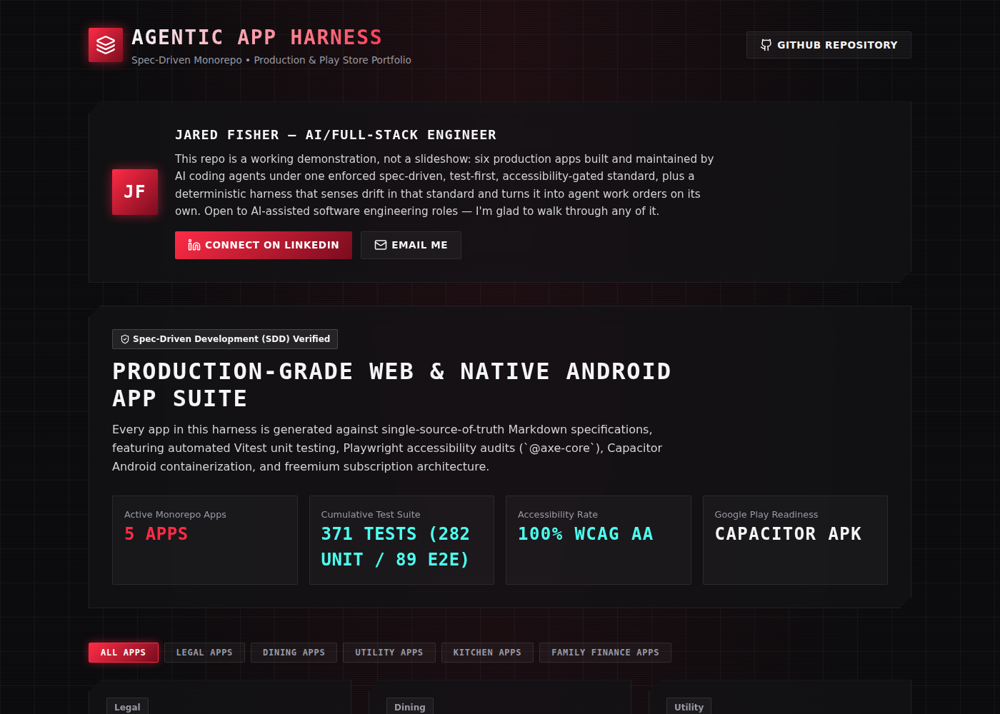

# Agentic App Harness

A **spec-driven development (SDD) harness** for building and maintaining production-grade web & mobile apps with AI coding assistants — where the quality bar (runtime schemas, unit + E2E tests, accessibility, spec coverage) is **enforced in CI, not just documented**.

> **What "agentic" means here:** the apps in this repo are built and maintained by AI coding agents working under strict rules in [`.agents/AGENTS.md`](.agents/AGENTS.md). This project is the *harness* around that workflow — the specs, scripts, and CI gates that keep AI-assisted development rigorous and drift-free. The harness also **closes its own improvement loop** (see the **Agentic Loop** section below): it senses drift and regressions and generates agent work orders **deterministically, with no embedded LLM or API key** — the AI agent is a pluggable actuator, not a hardcoded dependency.

It hosts six real, deployed applications and holds every one of them to the same enforced standard.

<p align="center">
  <a href="https://jf1shh.github.io/agentic-app-harness/">
    
  </a>
  <br>
  <sub>Live at <a href="https://jf1shh.github.io/agentic-app-harness/">jf1shh.github.io/agentic-app-harness</a></sub>
</p>

---

## 🌐 Live GitHub Pages Showcase & Applications

- **Master Portfolio Showcase Hub:** [https://jf1shh.github.io/agentic-app-harness/](https://jf1shh.github.io/agentic-app-harness/)
- **MoodDiner (Smart Restaurant Recommender & Booking App):** [https://jf1shh.github.io/agentic-app-harness/mood-diner/](https://jf1shh.github.io/agentic-app-harness/mood-diner/)
- **Travel Packing App (Wardrobe & Knapsack Weight Optimizer):** [https://jf1shh.github.io/agentic-app-harness/travel-packing-app/](https://jf1shh.github.io/agentic-app-harness/travel-packing-app/)
- **Smart Kitchen Recipe Manager (Meal Planner & Pantry):** [https://jf1shh.github.io/agentic-app-harness/smart-recipe-app/](https://jf1shh.github.io/agentic-app-harness/smart-recipe-app/)
- **LexiVault Financial RAG (100% Local Private Legal RAG & Security Engine):** [https://jf1shh.github.io/agentic-app-harness/legal-financial-rag/](https://jf1shh.github.io/agentic-app-harness/legal-financial-rag/)
- **Elder Care Cost Planner (All-In Care Costs, Funding Runway & Fair Family Split):** [https://jf1shh.github.io/agentic-app-harness/elder-care-planner/](https://jf1shh.github.io/agentic-app-harness/elder-care-planner/)

---

## Directory Structure

- `projects/`: npm workspace (`projects/*` in the root `package.json`) containing all web & mobile applications. Shared devDependencies (`react`, `typescript`, `vitest`, `@playwright/test`, `eslint`, …) dedupe into a single root `node_modules` via one root `package-lock.json`; each app keeps its own `package.json` and independent version ranges — run `npm install` once at the repo root rather than per app.
  - `projects/portfolio-hub`: Master Showcase Web Portal (Port 3009).
  - `projects/mood-diner`: Smart Restaurant Recommender & Table Booking Engine (Port 5178).
  - `projects/travel-packing-app`: Smart Wardrobe Packing Assistant (Port 3000).
  - `projects/smart-recipe-app`: Smart Kitchen Recipe Manager (Port 3005).
  - `projects/legal-financial-rag`: 100% Client-Side Private RAG for Legal Counsel & Financial Compliance (Port 3010).
  - `projects/elder-care-planner`: Offline-first elder care cost, runway and family cost-sharing planner, with cited cost data, per-figure confidence tags and a "how was this calculated?" derivation behind every headline number (Port 3011).
- `specs/`: Markdown specifications for every application. These are the **single source of truth**.
- `scripts/`: Master harness CLI plus verification, cleanup, mobile, and scaffolding scripts (`harness.ps1`, `test-app.ps1`, `validate-specs.ps1`, `clean-app.ps1`, `build-mobile.ps1`, `scaffold-app.ps1`), and the agentic-loop core plus the full per-app suite (`harness-status.mjs`, `emit-tasks.mjs`, `harness-learn.mjs`, `harness-history.mjs`, `test-app.mjs`, `serve-dist.mjs` — zero-dependency Node, cross-platform).
- `tasks/`: Auto-generated, bring-your-own-agent work orders emitted by the loop, plus the agent contract (`tasks/README.md`).
- `.agents/`: Harness control layer. `AGENTS.md` holds the engineering rules AI coding agents must follow in this repo.

---

## Engineering Standards (enforced, not aspirational)

1. **Spec-Driven Development (SDD)**: Specs dictate architecture, data models, and acceptance criteria before code is written.
2. **Contract-First Schema Validation (Zod)**: Every app defines its data models as runtime Zod schemas and infers its TypeScript types from them (`z.infer<typeof Schema>`), validating untrusted input (storage, imports) at the boundary.
3. **Behavior-Driven Development (BDD)**: All E2E and unit scenarios follow `Given [Context] -> When [Action] -> Then [Outcome]`.
4. **Unit-Test-Driven Development**: Every change to a logic module (`src/lib`, `src/utils`, `src/services`, `src/engine`, `src/data`, …) starts with a failing Vitest case, and any behaviour a PR claims to protect must be proved by breaking the code and watching the test go red. This is **gated**, not just asked for: `senseUnitTests` fails the build on any logic module that no unit test reaches, any unit test missing `Given/When/Then`, and any Vitest config without an explicit `include`. Its line-level half, the `no-op-assertion` guardrail, blocks too: an `expect()` with no matcher, or a type annotated against itself, is a test that cannot fail. The check shipped non-blocking and was promoted once the backlog it found (15 untested modules, 12 unformatted test files) was closed — a check gates when it describes a regression, not while it still describes history.
5. **Mandatory Testing & Verification**: Each app must pass `node scripts/test-app.mjs <AppName>` — security audit, ESLint, type-check, Vitest, and Playwright E2E + `@axe-core` accessibility. Cross-platform, so the authoritative gate runs anywhere Node does (`.\scripts\test-app.ps1 -AppName <AppName>` wraps it).
6. **5 Defense-in-Depth Security Hardening Layers**: LexiVault includes zero-exfiltration CSP headers, PBKDF2 passphrase key derivation (100,000 iterations), auto-lock timer, ReDoS/prompt injection shield, and tamper-evident blockchain-style hash chaining.
7. **Enforced in CI**: The `Harness Testing Suite` workflow runs the full gate for every app on each push, and the `SDD Sentinel` workflow runs `validate-specs.ps1 -Strict` on pull requests — which **fails the build** if any app is missing a spec, Zod schema, or BDD specs. Compliance is a gate, not a claim.
8. **Cited Figures Carry Their Own Confidence**: Where an app shows a number that came from outside it, that number carries a provenance tag (`verified` / `needs_verification` / `derived`) and the UI surfaces it next to the figure. The rule that makes this more than decoration: **a figure derived from a cited one needs its own tag**, never its row's. A published median tagged `verified` does not make a spread computed around it verified too — that is laundering an uncertain figure into a confident one, and it is the failure mode most likely to survive review, because the sentence reads well. Where no trustworthy figure exists, the honest output is a labelled fallback or an empty dataset with a comment saying why — `STATE_MEDIANS` in `elder-care-planner` is deliberately empty, because a made-up state number is worse than an absent one.
9. **Continuous Learning Loops**: Edge cases and lessons are persisted back into `.agents/AGENTS.md` so the same mistake isn't repeated — and, where mechanically detectable, promoted into an enforced guardrail (see below).

---

## 🔁 The Agentic Loop (Sense → Propose → Verify → Learn)

The harness closes its own improvement loop — **with no embedded LLM and no API key.** The AI coding agent is a pluggable actuator (Claude Code, Cursor, Copilot, Aider, …); the repo stays provider-neutral. The loop core is zero-dependency Node ESM, so it runs identically in CI and on any dev machine, with or without PowerShell — the `Harness Testing Suite` invokes `node scripts/test-app.mjs` directly on `ubuntu-latest`.

```
SENSE      node scripts/harness-status.mjs        → harness-status.json
PROPOSE    node scripts/emit-tasks.mjs            → tasks/<finding-id>.md
ACT        any AI agent claims a task, opens a PR
VERIFY     node scripts/harness-status.mjs --gate → CI fails on blocking findings
LEARN      node scripts/harness-learn.mjs         → CI fails unless new guardrails
                                                    trace to a documented lesson
```

| Stage | Command (or `.\scripts\harness.ps1 …`) | What it does |
|---|---|---|
| **Sense** | `harness.ps1 status` | Deterministically scans every app for missing artifacts, contract/BDD gaps, unit-test coverage of logic modules, spec drift (unchecked spec features), and anti-pattern guardrails distilled from `AGENTS.md`'s learned lessons — with file:line evidence — and writes `harness-status.json`. |
| **Propose** | `harness.ps1 tasks` | Turns each finding into a self-contained, bring-your-own-agent work order under `tasks/`. Idempotent; `--prune` retires resolved orders. See [`tasks/README.md`](tasks/README.md) for the contract. |
| **Act** | *(any agent)* | An agent claims an open task, does the work, and opens a PR. Agents **never self-merge** — a human reviews. |
| **Verify** | `harness.ps1 verify` | A **blocking** CI gate: fails on guardrail regressions and missing specs, while drift/manual-review only inform. The guardrails are themselves self-tested (`harness-status.test.mjs`), so the gate can't silently rot. |
| **Learn** | `harness.ps1 learn` | Enforces a closed **Lesson ⇄ Guardrail ⇄ Self-test** loop: a guardrail can't exist without a documented lesson, and a lesson can't claim enforcement without a working, tested guardrail — so the harness provably gets **stricter over time**. |

All four stages run in CI via [`.github/workflows/sdd-sentinel.yml`](.github/workflows/sdd-sentinel.yml) on every pull request. The loop is self-documented for agents in [`.agents/AGENTS.md`](.agents/AGENTS.md) §8, including the protocol for adding a new learned lesson.

**Making Learn data-driven**: `harness.ps1 history` (`scripts/harness-history.mjs`) records each
commit's per-rule finding counts into the git-tracked `harness-history.json`, then reports which
non-blocking sensors have gone quiet for long enough to be a **promotion candidate** and which
guardrails have **never once fired** — the same judgment call that promoted `unit-test-coverage`
in §8, now surfaced by a command instead of a memory. It decides nothing on its own; `isBlocking()`
still only changes by a human-reviewed PR.
